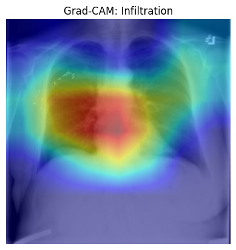

# 🩻 Radiology Triage with CNNs: EfficientNet-B0 vs ResNet-18

A comparative deep learning study on automated triage of chest X-ray images using NIH ChestX-ray14 dataset, focusing on distinguishing between three clinically significant conditions: **Atelectasis**, **Effusion**, and **Infiltration**. The project evaluates and contrasts two convolutional neural network architectures — **EfficientNet-B0** and **ResNet-18** — on accuracy, interpretability, and implementation efficiency.

---

## 📊 Project Motivation

Rapid and reliable triage of radiological images is critical in high-volume hospital settings, especially where radiologist resources are limited. Automating this step can assist clinicians in prioritizing cases for further review.

This project explores whether modern architectures like EfficientNet can offer improved performance over traditional ResNet baselines in terms of accuracy and efficiency, while also providing interpretable outputs via Grad-CAM.

---

## 🗃 Dataset

- **Source**: NIH ChestX-ray14 Public Dataset
  - images from https://www.kaggle.com/datasets/nih-chest-xrays/data (image files numbered 001 - 012)
- **Original Size**: 112,000+ frontal-view chest X-rays  
- **Selected Classes**: Top 3 most common labels  
  - `Atelectasis`, `Effusion`, `Infiltration`
- **Final Dataset Size After Filtering**: 25,000+ labeled images

---

## 🏗 Model Architectures

### 🔹 ResNet-18
- Classic CNN architecture with skip connections
- Final FC layer modified for 3-class classification
- Weighted Cross Entropy loss to address class imbalance

### 🔹 EfficientNet-B0
- Scalable model optimized for high accuracy with fewer parameters
- Pre-trained on ImageNet
- Modified head for 3-class output
- Smaller footprint with comparable or better accuracy than ResNet

---

## ⚙️ Implementation Overview

Each model was implemented in its own Jupyter Notebook using PyTorch:

### ✅ Common Preprocessing
- Loaded filtered subset of NIH images and labels
- Applied resizing, normalization, and data augmentation
- Created train/val/test splits (60/20/20)

### 🧠 ResNet Notebook
- Used `torchvision.models.resnet18` with modified output layer
- Trained using AdamW optimizer and weighted loss
- Added early stopping to prevent overfitting

### ⚡ EfficientNet Notebook
- Used `timm.create_model('efficientnet_b0', pretrained=True)`
- Applied same class weighting strategy
- Included Grad-CAM visualizations of attention maps

---

## 🧪 Results

| Metric            | ResNet-18     | EfficientNet-B0 |
|------------------|---------------|-----------------|
| **Test Accuracy** | ~69.9%        | ~76.2%          |
| **F1 (Macro Avg)**| ~0.66         | ~0.74           |
| **Best Recall**   | Infiltration (0.80) | Infiltration (0.86) |

🔍 **Grad-CAM** heatmaps showed attention focused on plausible disease regions in the lungs, supporting interpretability.




> Model focuses attention on clinically relevant regions for **Infiltration**.

---

## 🧠 Key Takeaways

- EfficientNet-B0 slightly outperforms ResNet-18 while using fewer parameters and lower computational cost.
- Infiltration was consistently the most accurately predicted class, likely due to stronger visual patterns.
- Grad-CAM maps helped validate that both models were focusing on clinically relevant features.
- Project demonstrates practical application of modern CNNs in medical imaging triage.

---

🔮 **Future improvements could include**:
- Training on more rare or complex labels
- Incorporating Bayesian dropout or ensembling for confidence scores
- Cross-institutional validation for robustness

---

## 🧾 Files in This Repo
- notebooks
  - EfficientNet_B0_X_Ray_Image_Classification.ipynb
  - ResNet18_X_Ray_Image_Classification.ipynb
- report
  - Radiology_X_Ray_Classification_Report.pdf

---

## 🚀 Getting Started

1. Clone the repository:
   ```bash
   git clone https://github.com/yourusername/radiology-triage-cnn.git
   cd radiology-triage-cnn
   
2. Run either notebook in Jupyter or Colab:
- EfficientNet...ipynb
- ResNet...ipynb
  
⚠️ Image files are not included in this repo due to size — you will need to mount your own copy of the NIH ChestX-ray14 dataset and adjust the image_dir paths.

--- 

## 📬 Contact

For questions or collaboration ideas, please reach out or open an issue on GitHub.
